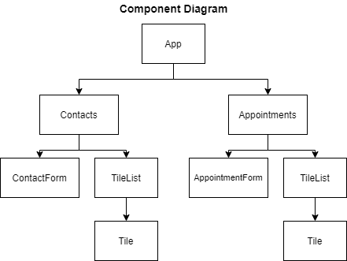

`NOTES:` as i have been completing the project there have been changes made to the project:

- react-hook-form was picked for easy handling the form submision
- component diagram has been changed for UX
- added responsivenes: desctop, tablet, mobile.
- bootstrap styling libriry was noot used (as the scale of project's components were not complex was easy to navigate)
- as per project requirement supposed to be used CRA but for the sake of learning experiment was used VITE tool

# Getting started

[starting point](https://medium.com/@galohernandez/vite-react-react-router-dom-the-latest-way-312ee887197e)

```bash
# follow prompt
npm create @vite/latest .

#next install bootstrap for developemnt styling
npm npm install react-bootstrap bootstrap  

#import it to index.css ```import 'bootstrap/dist/css/bootstrap.min.css';```

#install latest react router

npm install react-router-dom localforage match-sorter sort-by

# to handle form I found a libriry for form validation
https://www.react-hook-form.com/get-started/#Quickstart
# examples
https://github.com/react-hook-form/react-hook-form/tree/master/examples

npm install react-hook-form
```

## Challenge Project: Appointment Planner

Alright, here we go. So, this project isn't one of those step-by-step tutorials. Nope, it's more like a bunch of challenges that describe what we're building. Don't worry if things don't line up exactly – there are plenty of ways to nail these requirements. And hey, don't hesitate to dive into the web, hit up Codecademy, and any other resources you find useful. Sometimes, we all need a little help.

Now, let's talk about what we're building here. We're diving into functional React components – these babies are our go-to for creating an app that's all about managing contacts and appointments. We're splitting this app into two pages. First, we've got the contact page – it's where we view and add new contacts. Then, there's the appointment page – that's where appointments are king, and we can view and add new ones.

`old diagram`


`new diagram`

So, in this project, we're going to be dealing with two types of React components: stateful and stateless functional ones. And guess what? We'll be using hooks – those nifty tools that make managing state a breeze.

In this project I will be using vite tool for creating React app for experiment and to go with trend beyond  then CRA (create react app).

### `App`

Based on the given requirements, implement App as a stateful component that maintains appointments and contacts. It should also pass those values, along with callback functions to update those state values, to its child components.

App Requirements:

- Keep track of the contacts and appointments data, each being an array of objects
- Define a callback function that, given a name, phone number, and email, adds a new contact object with that data to the array of contacts
- Define a callback function that, given a name, contact, date, and time, adds a new appointment object with that data to the array of appointments
- Pass the array of contacts and the appropriate callback function as props to the ContactsPage component
- Pass the appointments array, contacts array, and the add appointment function as props to the AppointmentsPage component

### `ContactPages`

Based on the given requirements, implement ContactsPage as a stateful component to handle the logic for adding new contacts and listing current contacts.

ContactsPage Requirements:

- Receive two props:
  - The current list of contacts
  - A callback function for adding a new contact
- Keep track of three local state values: the current name, phone, and email entered into the form
- Check for duplicates whenever the name in the form changes and indicate the name is a duplicate
- Only add a new contact on form submission if it does not duplicate an existing contact’s name
- A successful submission should clear the form
- In the Add Contact section, render a ContactForm with the following passed via props:
  - local state variables
  - local state variable setter functions
  - handleSubmit callback function
- In the Contacts section, render a TileList with the contact array passed via props

### `ContactForms`

Based on the given requirements, implement ContactForm as a stateless component that renders a web form to collect the necessary contact information.

ContactForm Requirements:

- Render a form with:
  - The onSubmit attribute set
  - 3 controlled `<input>` elements, one for each piece of contact data
  - A submit button
- Include a pattern attribute to the phone `<input>` with a regex that matches the phone locale of your preference

### `TileList`

Based on the given requirements, implement **TileList** as a stateless component that renders a list of Tile components using an array of objects.

TileList Requirements:

- Receive one prop:
  - An array of objects to render as a list
- Use the array passed via props to iteratively render Tile components, using each object in the array to pass the name and description props to each rendered **Tile** component

The requirements for the TileList component are generalized and allow it to be shared by the ContactsPage and AppointmentsPage components. As long as an array of objects with either the contact data or appointments data is passed then the content will be handled appropriately.

### `Tile`

Based on the given requirements, implement Tile as a stateless component that renders the data from an object.

Tile Requirements:

- Receive two props:
  - name
  - description
- Render a `<p>` element with the name prop. Give this element a className of "tile-title"
- Iterate over the values in the description object, passed in via props, and render a <p> element for each value and give each a className of "tile".
Just like the `TileList` component, the Tile component is generalized to work with data from any object. This allows it to be used in both the ContactsPage and AppointmentsPage components.

### `AppointmentsPage`

Based on the given requirements, implement AppointmentsPage as a stateful component that handles the logic for adding new appointments and listing current appointments.

AppointmentsPage Requirements:

- Receive three props:
  - The current list of appointments
  - The current list of contacts
  - A callback function for adding a new appointment
- Keep track of four local state variables, the current name, contact, date, and time entered into the form
- Add a new appointment on form submission
- Clear the form on submission
- In the Add Appointment section, render an AppointmentForm with the following passed via props:
  - local state variables
  - local state variable setter functions
  - handleSubmit callback function
- In the Appointments section, render a TileList with the appointment array passed via props

### `AppointmentForm`

Based on the given requirements, implement AppointmentForm as a stateless component that renders a web form to collect the necessary appointment information.

AppointmentForm Requirements:

- Render a form with:
  - The onSubmit attribute set to the callback function passed in via props
  - 3 controlled input components, to be used for the name, date and time appointment data
  - A ContactPicker component with the contacts list passed in via props
  - A submit button
- Use getTodayString() to set the min attribute of the date input

### `ContactPicker`

Based on the given requirements, implement ContactPicker as a stateless component that renders a drop-down list of all contact names.

ContactPicker Requirements:

- Receive 4 props:
  - The array of contacts
  - A callback function to handle when the onChange event is triggered
  - value
  - name
- Render a select element with the onChange attribute set to the callback passed in via props, a value attribute set to the value prop, and a name attribute set to the name prop.
- Add a default option element with the text “No Contact Selected” and a value attribute of "".
- Iteratively add option elements using the contact names from the array passed in via props
